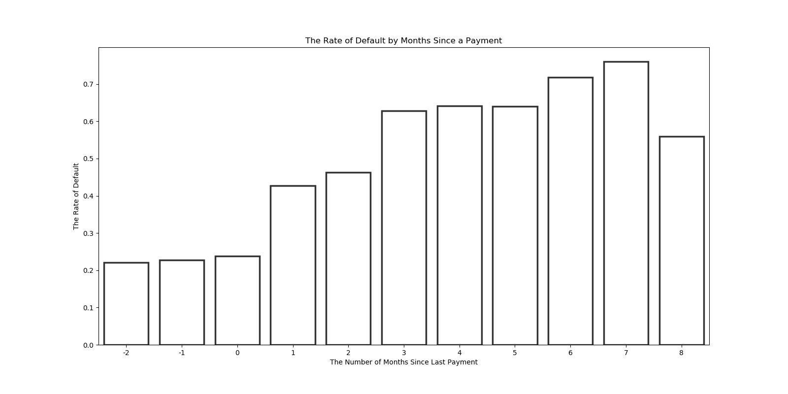
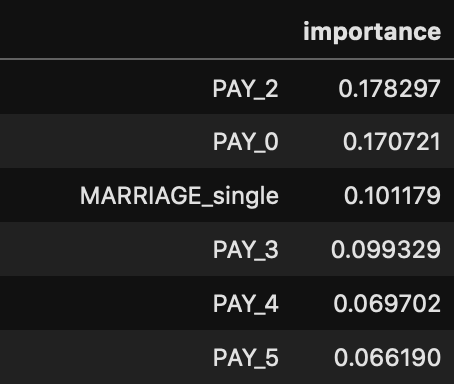

# Credit Card Default, Taiwan 2005.
## Progression
  1. Dataset acquired from UCI Machine Learning Database
  2. Exploratory data analysis has been performed
  3. Various ML algorithms have been applied and optimized
  4. Visualizations added
  5. **The findings have been presented**

# Introduction
An idea slipped into me as I was watching UVA Law professor giving a mock class on YouTube: what are the things that all humans do? In the scope of her class, the answer was procreation. I, however, immediately thought of monetary exchange and grabbed my phone to pay the credit balance. As I was lamenting over how much I had spent, I began to wonder if there could be any indicators, as a consumer, that would raise a red flag-the one that would warn me the chances of my bankruptcy! Thankfully, UCI's Machine Learning Repository had a great dataset of people declaring default given numerous features (super grim, I know). Although this dataset illuminates the consumers of Taiwan in 2005, I assumed that human behavior in modernized society couldn't differ that greatly.

Let's get started

## Datasets
- *default of credit card clients* by I-Cheng Yeh

## Metrics to consider:
##### Payment Status
This dataset, which seems very reasonable at first, has its riddles; the payment status(PAY_0~PAY_5)
is marked by a digit ranging from -2 to 8. To add to the confusion, the description provided by UCI's Machine
Learning repository claims that those columns have digits ranging from -1 to 8. Thankfully, the user 'ezboral' on Kaggle
reached out to the professor who created the dataset and shared the following:

"-2: No consumption;
-1: Paid in full;
0: The use of revolving credit;
1 = payment delay for one month;
2 = payment delay for two months;
 . . .;
 8 = payment delay for eight months;
 9 = payment delay for nine months and above."

Also, mfahey further clarified each digit's meaning in the comment section of the thread:
"-2 = Balance paid in full and no transactions this period (we may refer to this credit card account as having been 'inactive' this period)
-1 = Balance paid in full, but the account has a positive balance at end of the period due to recent transactions for which payment has not yet come due
0 = Customer paid the minimum due amount, but not the entire balance. I.e., the customer paid enough for their account to remain in good standing, but did revolve a balance"

Of course, this information has to be taken with a grain of salt. Nonetheless, they seem very reasonable.

##### Dates
The data frame in this dataset also needs a bit of guidance: The number after pay/bill_amt/pay_amt indicates the months before the deadline (of the data collection). Bill_amt6, for instance, would be billed amount in April 2005, whereas bill_amt5 would be May 2005.

## Methodology
This dataset was already greatly refined; all features (other than the fore-mentioned) were fairly intuitive and the target was clearly defined. As such, I started the process by converting categorical variables to continuous.

In the process of EDA, I began to notice that quite a lot of people paid more than they were charged in a month. I've found this trend to be interesting and thought just having that negative number would have a chance of increasing the accuracy of the model. Thus, I added six columns that simply subtracted the billed amount (N) and payment amount (N-1).

## Findings
##### Payment delays and the rate of default
Although I began whimsically and somewhat light-heartedly, the credit card default isn't a thing to laugh over; people don't declare a default in normal circumstances. Having that said, I wanted to see the rate of people escaping from the inevitable, i.e. getting back on the track after having delayed payments (no, not THAT inevitable).

Notably, there is no difference in the rate when comparing those who are utilizing the credit and those who do not (-2~0). The rate, expectedly, increases as the number of delayed months increase but not in a linear fashion; there's a jump on the first month, and another jump on the 3rd. Should the fact that the rate of **NOT**-default at 6 months of delay is 30 percent shine hopes those in trouble?

Well, I'll just leave it as is; you can be the one to decide.

##### ML Model
Since this project is comprised of several models, I'll briefly list the results and elaborate more on the model that I've found to be the most illuminating.

| Algorithm | Accuracy | Precision (weighted avg) | Recall (weighted avg)| AUC | F-1 Score (weighted avg)|
| ------------- |:------------:|:-------------------------------:| :-----------------------:| :-------------:|:--------:|
| Logistic | .56 | .73 | .56 | .66 | .60 |
| SVC | .77 | .72 | .77 | .50 | .67|
| KNN | .60 | .69 | .60 | .58 | .63|
| Gaussian NB | .33 | .73 | .33 | .65 | .29 |  
| Linear SVC | .57 | .71 | .57 | .64 | .60|
| Stochastic GD | .49 | .70 | .49 | .57 | .52|  
| Decision Tree | .67 | .72 | .67 | .67 | .69|
| **Random Forest** |**.76** | **.77** | **.76** | **.74** | **.77**|

##### Conclusion
As the above table shows, the Random Forest classifier is the most accurate model overall. But what about the question I had from the start?-what are the things I could look for to 'foresee' (if it isn't clear enough) my default? Those statistical accuracies are just useless when it comes to that. So, let's consider the feature importances, which is a part of the Random Forest classifier that gives us the features that mattered the most:

As shown by the table, the payment statuses matter the most when predicting if a consumer would declare a default-no surprise there. What's noticeable is "marriage_single". A person's marital status, too, played an important role when predicting the default and that felt a little odd as a person living in the year 2020. It's well known that the percentage of couples getting married is droping significantly and the trend is unlikely to change. Would that mean that we should also predict the increase in the rate of default for the times to come? My instinct says no, but a Forbes' article tells me otherwise.

Like many data scientists, I have no choice but to say: there seems to be a correlation, but the actual causation needs to be examined in the future.

## Resources
- I-Cheng Yeh, *Default of credit clients,* https://archive.ics.uci.edu/ml/datasets/default+of+credit+card+clients

- ezboral, *Answer to missing values (-2, 0) not in measurement scale,* https://www.kaggle.com/uciml/default-of-credit-card-clients-dataset/discussion/34608

- Jay L. Zagorsky, *Why are fewer people getting married?* https://www.pbs.org/wgbh/third-rail/episodes/episode-7-is-marriage-dead/why-are-fewer-people-getting-married/

- Bill Hardekopf, *This Week In Credit Card News: Rise In Card Delinquencies; Cards Found To Be Dirtiest Payment Method,* https://www.forbes.com/sites/billhardekopf/2019/05/24/this-week-in-credit-card-news-rise-in-card-delinquencies-cards-found-to-be-dirtiest-payment-method/#3bd6da352624
